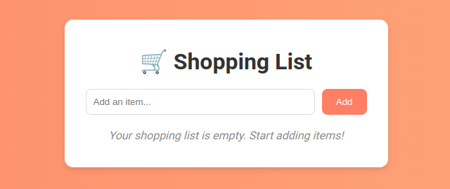

# 🛒 Shopping List Web App

A simple and visually appealing shopping list app built with React.js, containerized with Docker, and ready for deployment using GitHub Actions. 



---

## 🌟 Features

- **Add Items:** Quickly add items to your shopping list.
- **Remove Items:** Remove items with a single click.
- **Modern Design:** A clean and responsive UI with a vibrant gradient background.
- **Dockerized:** Easily containerized for deployment.
- **CI/CD Pipeline:** Automated Docker image building and pushing using GitHub Actions.

---

## 🚀 Getting Started

Follow these steps to run the app locally or deploy it using Docker.

### Prerequisites

- [Node.js](https://nodejs.org/) (v18 or higher)
- [Docker](https://www.docker.com/)
- A GitHub account for CI/CD setup

---

### Local Development

1. **Clone the repository:**
   ```bash
   git clone https://github.com/mng-g/devops-gh-actions-shopping-list
   ```
2. **Install dependencies:**
   ```bash
   npm install
   ```
3. **Run the app:**
   ```bash
   npm start
   ```
The app will be available at http://localhost:3000.

---

### 🐳 Using Docker

1. **Build the Docker image:**
   ```bash
   docker build -t shopping-list .
   ```
2. **Run the Docker container:**
    ```bash
    docker run -p 8080:80 shopping-list
    ```
Access the app at http://localhost:8080.

---

### 🌐 CI/CD with GitHub Actions

This repository includes a GitHub Actions workflow that automatically builds and pushes a Docker image to GitHub Container Registry (GHCR).

1. Make sure the `ghcr.io` permissions are properly configured for your repository.
2. Push changes to the `main` branch to trigger the workflow.
3. The Docker image will be available at `ghcr.io/mng-g/shopping-list`.

---

## 🛠️ Project Structure

```plaintext
shopping-list/
├── public/             # Static files
├── src/                # React components
├── .github/workflows/  # GitHub Actions CI/CD workflow
├── Dockerfile          # Docker configuration
├── package.json        # Project metadata and dependencies
├── README.md           # Project documentation
```

---

## 📸 Screenshots

Add some screenshots here to showcase your app in action:

| Desktop View                              | Mobile View                              |
|-------------------------------------------|------------------------------------------|
|  |  |

---

## ✨ Future Enhancements

- Add persistence with local storage or a backend database.
- User authentication for personalized lists.
- Shareable shopping lists via unique links.
- Add animations and transitions for better UX.

---

## 📝 License

This project is licensed under the [MIT License](LICENSE).

---

## 💬 Feedback and Contributions

If you have any feedback, suggestions, or want to contribute:
- Open an issue
- Submit a pull request

We'd love to hear from you! ❤️
